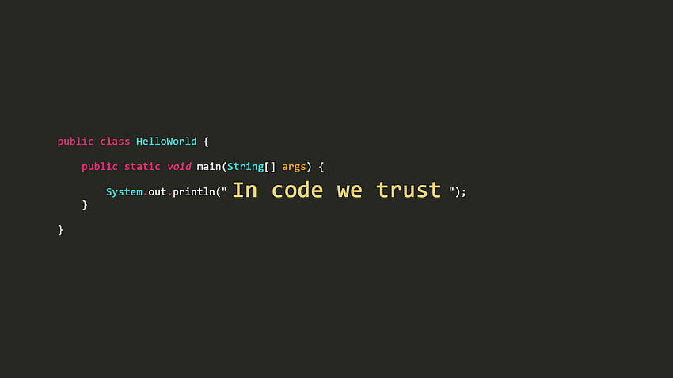

	

<h1 align="center">👋 Hi, welcome on my GitHub !</h1>

 

I'm <strong>Mateusz</strong>, a 28 years old  <strong>FULL STACK WEB DEVELOPER</strong>.

I had the opportunity to be a student of the Boolean school which started a more professional study of my passions related to the world of the web.

 

<h3> What can you see on my profile?</h3>

 

Projects created by me, some very simple that were studied at the beginning of my training (in the end, we all start with "Hello World"), others more complex that put me to the test and that I wanted to share with you. 
 

<h3>How to contact me?</h3>

 

[][linkedin] <strong> Connect with me on Linkedin</strong>

[linkedin]: https://www.linkedin.com/in/mateusz-kacperski-b39848146/

 

<h3>💻 Skills</h3>

 

	
	
	
	
	
	

	
	
	
	
	
	 

 

Thanks for visiting my account

